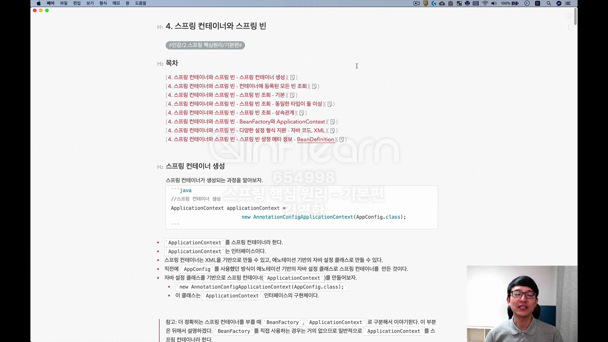
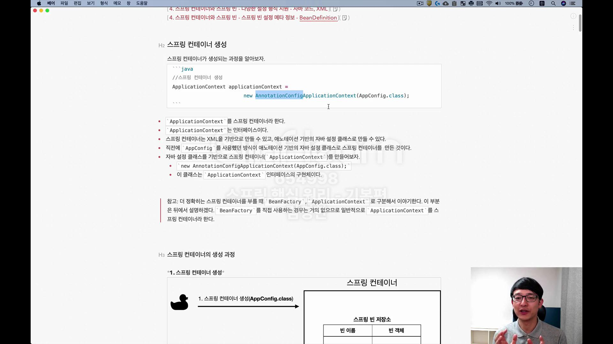
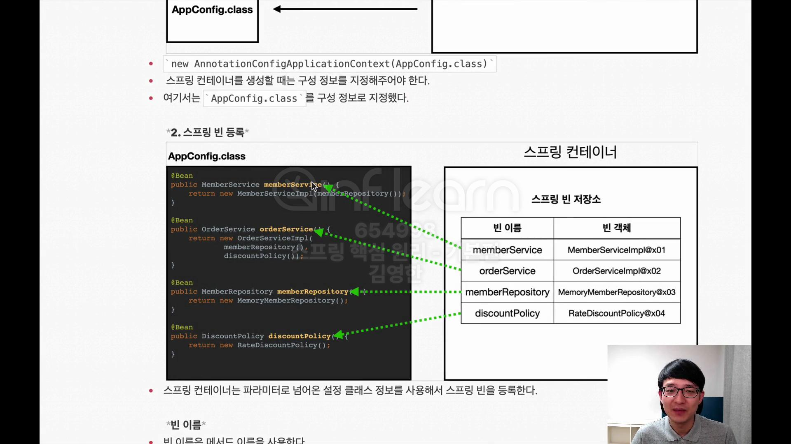

## AppConfig 리팩터링 

## 새로운 구조와 할인 정책 적용 
- 할인 정책을 변경해보자. FixDiscountPolicy -> RateDiscountPolicy 
- AppConfig 코드만 고치면 됨. 
- AppConfig(구성영역)는 당연히 변경됨. 공연 기획자는 공연 참여자인 구현 객체들을 모두 알아야함. 
- 사용영역(OrderServiceImpl)은 전혀 변경할 필요 없음. 

## 전체 흐름 정리 

## 좋은 객체 지향 설계의 5가지 원칙 적용 

## IoC, DI 그리고 컨테이너 

## 동적인 객체 인스턴스 의존 관계 

## 스프링으로 전환하기 
- 'ApplicationContext'를 스프링 컨테이너라 함. 
- 기존에는 개발자가 'AppConfig' 사용해서 직접 객체를 생성하고 DI를 했지만, 이제부터 스프링 컨테이너를 통해 사용함. 
- 스프링 컨테이너는 @Configuration이 붙은 'AppConfig'를 설정(구성)정보로 사용함. 여기서 @Bean이라 적힌 메서드를 모두 호출해서 반환된 객체를 스프링 컨테이너에 등록함. 
    이렇게 스프링 컨테이너에 등록된 객체를 '스프링 빈'이라고 함. 
- 스프링 빈은 @Bean이 붙은 메서드의 명을 스프링 빈의 이름으로 사용함('memberService', 'orderService')
- 기존에는 개발자가 직접 자바코드로 모든 것을 했다면 이제부터 스프링 컨테이너에 객체를 스프링빈으로 등록하고, 스프링 컨테이너에서 스프링 빈을 찾아서 사용하도록 변경함. 
- 스프링 컨테이너를 사용하면 어떤 장점이 있을까?  

#### 문제 

MemberApp 실행했을때 bean 생성되었다고 터미널에 뜨지 않음. 

# 4. 스프링 컨테이너와 스프링 빈 

## 스프링 컨테이너 생성 

## 스프링 빈 등록 

- 빈이름을 직접 부여할 수도 있음 
- 빈이름은 항상 다른 이름을 부여 해야 함

## 스프링 빈 의존관계 설정 - 준비 

## 컨테이너에 등록된 모든 빈 조회 