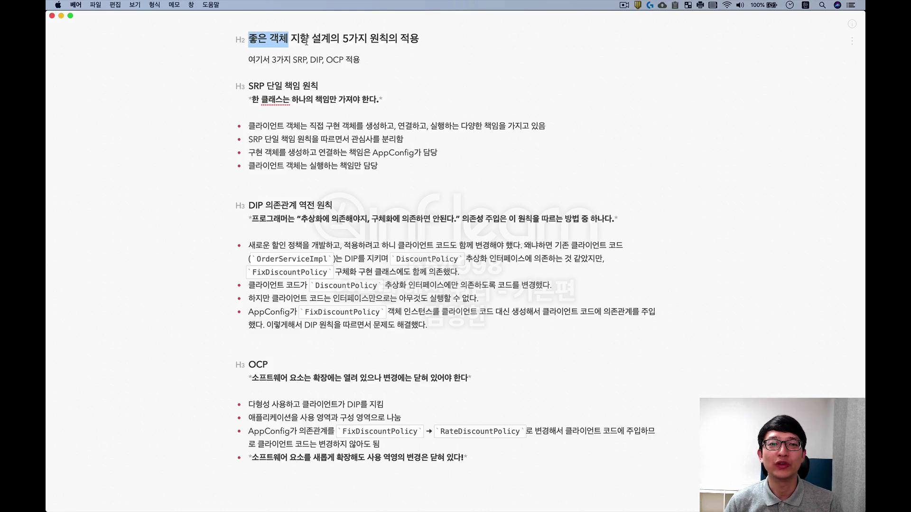
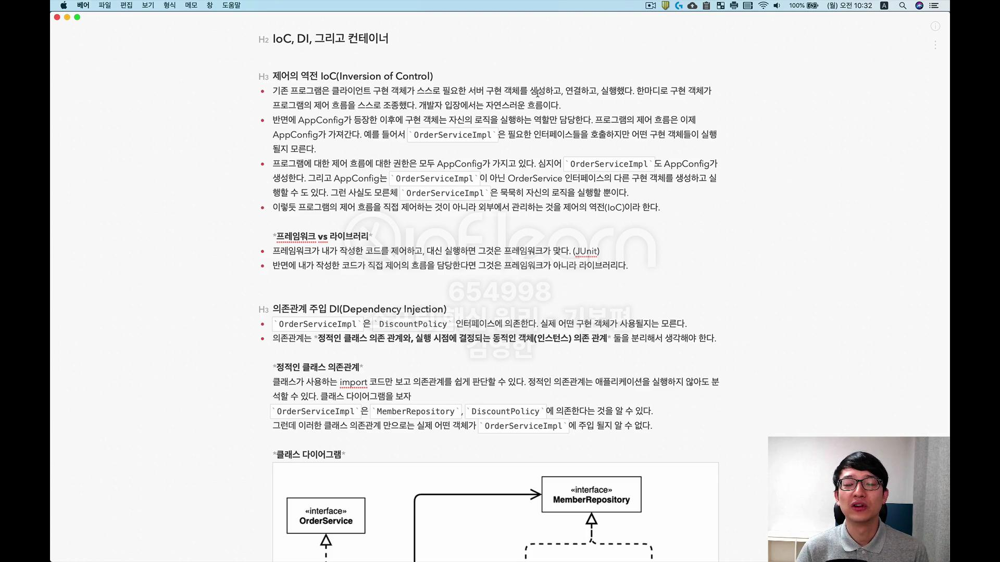

## AppConfig 리팩터링 

## 새로운 구조와 할인 정책 적용 
- 할인 정책을 변경해보자. FixDiscountPolicy -> RateDiscountPolicy 
- AppConfig 코드만 고치면 됨. 
- AppConfig(구성영역)는 당연히 변경됨. 공연 기획자는 공연 참여자인 구현 객체들을 모두 알아야함. 
- 사용영역(OrderServiceImpl)은 전혀 변경할 필요 없음. 

## 전체 흐름 정리 

## 좋은 객체 지향 설계의 5가지 원칙 적용 

## IoC, DI 그리고 컨테이너 

## 동적인 객체 인스턴스 의존 관계 
