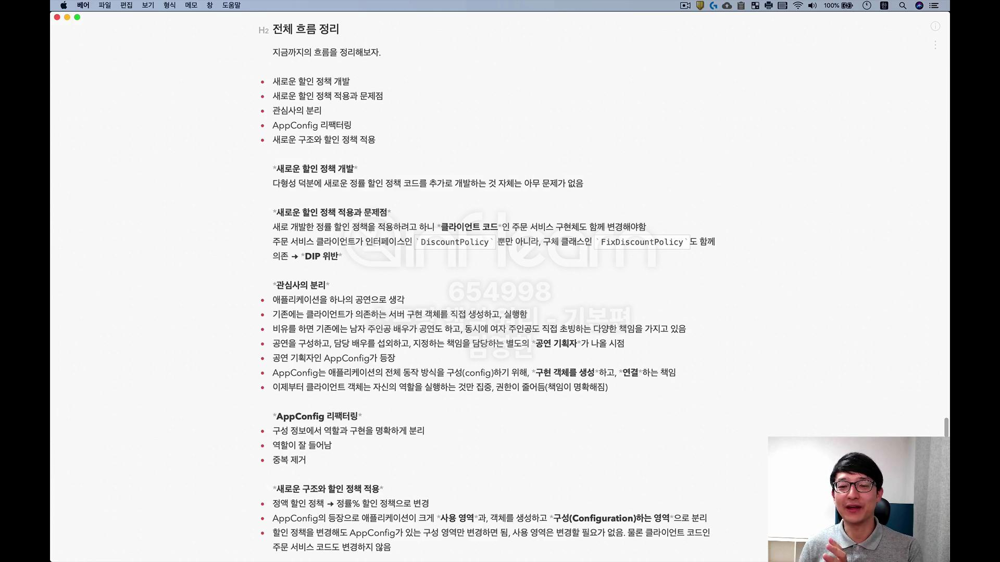
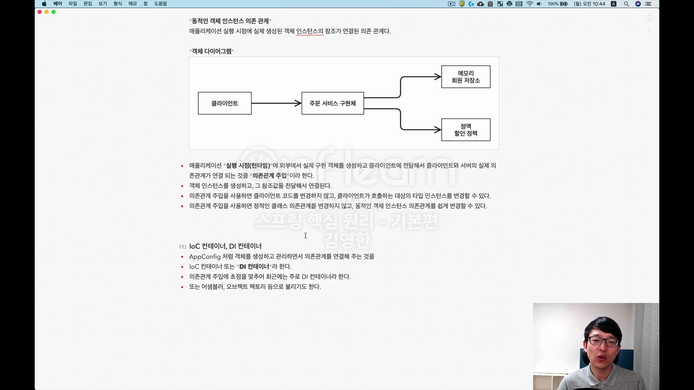
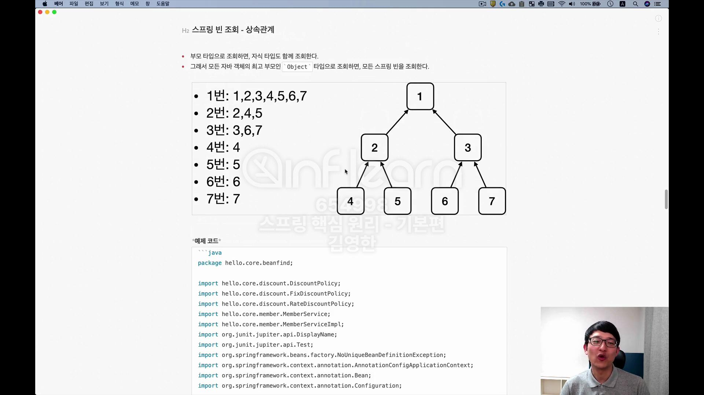

## AppConfig 리팩터링 

## 새로운 구조와 할인 정책 적용 
- 할인 정책을 변경해보자. FixDiscountPolicy -> RateDiscountPolicy 
- AppConfig 코드만 고치면 됨. 
- AppConfig(구성영역)는 당연히 변경됨. 공연 기획자는 공연 참여자인 구현 객체들을 모두 알아야함. 
- 사용영역(OrderServiceImpl)은 전혀 변경할 필요 없음. 

## 전체 흐름 정리 

## 좋은 객체 지향 설계의 5가지 원칙 적용 

## IoC, DI 그리고 컨테이너 

## 동적인 객체 인스턴스 의존 관계 

## 스프링 빈 조회 - 상속관계 
- 부모 타입으로 조회하면, 자식 타입도 함께 조회된다. 
- 자바 객체 최고 부모인 Object 타입으로 조회하면, 모든 스프링 빈을 조회한다. 

## BeanFactory와 ApplicationContext 
- BeanFactory 
- 스프링 컨테이너의 최상위 인터페이스 
- 스프링 빈을 관리하고 조회함
- getBea()을 ㅈ제공함

<ApplicationContext>
- BeanFactory 기능을 모두 상속 받아 제공함 
- 둘의 차이는? 
- 애플리케이션 개발할때는 빈을 관리/조회하는 기능은 물론, 그 외 수 많은 부가 기능 필요함. 
- 메시지 소스를 활용한 국제화 기능. 
- 환경변수 
- 애플리케이션 이벤트 
- 편리한 리소스 조회 

### 정리 
- BeanFactory 를 직접 사용할 일은 거의 없다. 부가 기능이 포함된 ApplicationContext를 사용함. 
- BeanFactory 나 ApplicationContext 를 스프링 컨테이너라고 함. 

## 다양한 설정 형식 지원 - 자바코드, XML 

- 스프링 컨테이너는 다양한 형식의 설정 정보를 받아드릴 수 있음. 

### 애노테이션 기반 자바 코드 설정 사용 
### XML 설정 사용 
- 최근에 거의 사용하지 않음. 레거시만 
- 컴파일 없이 설정 정보 저장할 수 있는 장점은 있음. 

## 스프링 빈 설정  메타 정보 = BeanDefinition
- 스프링은 어떻게 이런 다양한 설정 형식을 지원하는가? BeanDefinition 이라는 추상화때문에. 
- 역활과 구현을 개념적으로 나눈 것임. 
  - XML 읽어서 BeanDefinition 만들면 됨 
  - 스프링 컨테이너는 자바코드인지, XML 인지 몰라도됨. BeanDefinition 만 알면 됨 
- BeanDefinition 을 빈 설정 메타정보라 함. 
  - @Bean, <bean> 당 각각 하나씩 메타 정보가 생성됨 
- 스프링 컨테이너는 메타정보 기반으로 스프링 빈을 생성함. 

# 웹 어플리케이션과 싱글톤 
- 스프링은 기업용 온라인 서비스 기술 지원위해 탄생함 
- 대부분 스프링 애플리케이션은 웹 애플리케이션임. 
- 웹 애플리케이션은 보통 여러 고객이 동시에 요청함

## 싱글톤 패턴 
- 클래스의 인스턴스가 1개만 생성되는 것을 보장. 
- private 생성자를 사용해 외부에서 new 키워드 사용하지 못하도록 막기. 

- 참고: 싱글톤 패턴을 구현하는 방법은 여러가지임. 여기서는 객체를 미리 생성해두는 가장 단순, 안전한 방법. 

### 싱글톤 패턴 문제점 
- 코드가 길어짐 
- 의존관계상 클라이언트가 구체 클래스에 의존함 - DIP 를 위반함 
- 클라이언트가 구체 클래스 의존해 OCP 위 반 가능성 
- 테스트하기 어려움
- 내부 속성 변경, 쵝화 어려움 
- 자식 클래스 만들기 어려움(PRivate 생성자)
- 유연성이 떨어짐
- 안티패턴으로 불리기도 함. 

## 싱글톤 컨테이너 
- 스프링 컨테이너는 싱글톤 패턴의 문제점을 해결하면서, 객체 인스턴스를 1개만  생성함 
- 스프링 컨테이너는 싱글톤 컨테이너 역할을 함. 싱글톤 객체 를 생성, 관리하는 기능을 싱글톤 레지스트리라 한다.

### 싱글톤 컨테이너 적용 후 
- 스프링 컨테이너 덕분에 고객의 요청이 올때마다 객체를 생성하는것이 아니라, 이미 만들어진 객체를 공유해서 효율적으로 재사용할 수 있음. 
- 참고: 스프링의 기본 빈 등록 방식은 싱글톤이지만, 싱글톤 방식만 지원하는 것은 아님. 요청할때마다 새로운 객체를 생성해 반환하는 기능도 제공함. 

## 싱글톤 방식의 주의점 
- 싱글톤 객체는 상태를 유지하게 설계하면 안됨 
- 무상태로 설계해야 함(stateless)
  - 특정 클라이언트에 의존적인 필드가 있으면 안됨 
  - 특정 클라이언트가 값을 변경할 수 있는 필드가 있으면 안됨 
  - 가급적 읽기만 가능해야함 
  - 필드 대신 자바에서 공유되지 않는 지역변수, 파라미터, ThreadLocal 등 사용해야함 
- 스프링 빈의 필드에 공유 값을 설정하면 큰 장애 발생 가능!

### 문제점 예시 
- StatefulService 의 price 필드는 공유되는 필드. 특정 클라이언트가 값을 변경함. 
- 사용자 A의 주문 금액은 만원이 되어야 하는데, 이만원이라고 나옴. 
- 공유 필드는 조심해야 함! 스프링 빈은 항상 무상태로 설계해야함. 

## @Configuration과 싱글톤 
